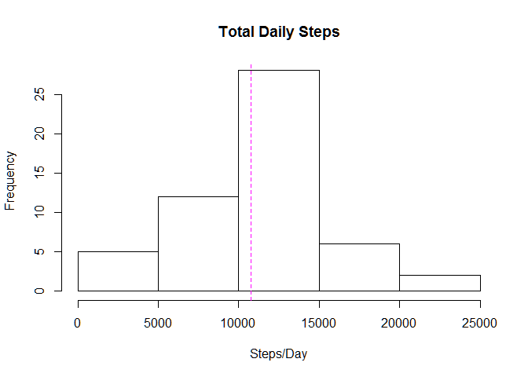
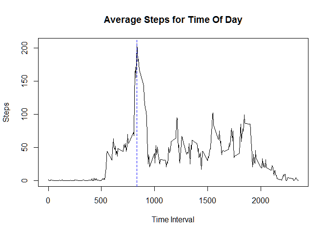
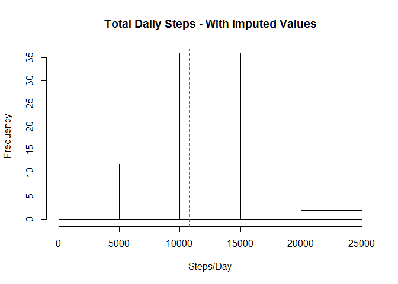
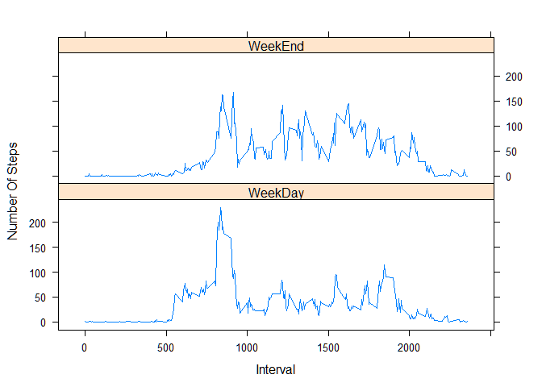

# Reproducible Research: Peer Assessment 1

## Loading and preprocessing the data
echo = TRUE


```r
library(dplyr)
```

```
## 
## Attaching package: 'dplyr'
```

```
## The following objects are masked from 'package:stats':
## 
##     filter, lag
```

```
## The following objects are masked from 'package:base':
## 
##     intersect, setdiff, setequal, union
```

```r
library(ggplot2)
```

```
## Warning: package 'ggplot2' was built under R version 3.2.3
```

```r
library(knitr)
```

```
## Warning: package 'knitr' was built under R version 3.2.3
```

```r
#### Skip the Download
#### download.file("https://d396qusza40orc.cloudfront.net/repdata%2Fdata%2Factivity.zip", destfile="activity.zip")

Activity <- read.csv( unz("activity.zip", filename="activity.csv"), header=T)

Activity <- tbl_df(Activity)

Activity$date <- as.Date(Activity$date, "%Y-%m-%d")

####
```

## What is mean total number of steps taken per day?


```r
#### Choose only Complete Cases
ValidActivity <- complete.cases(Activity)

Activity1 <- Activity[ValidActivity,]

#### Total Daily Steps
TotalDailySteps <- group_by(Activity1, date)

TotalDailySteps <- summarise(TotalDailySteps, sum(steps))

names(TotalDailySteps) <- c("Date", "TotalSteps")

#### Plot
with(TotalDailySteps, hist(TotalDailySteps$TotalSteps, xlab="Steps/Day", main="Total Daily Steps"))

#### Calculate Mean and Median
MeanSteps1 <- round( mean(TotalDailySteps$TotalSteps), 0 )

MedianSteps1 <- median(TotalDailySteps$TotalSteps)

abline(v = MedianSteps1, col = "blue", lty=2)

abline(v = MeanSteps1, col = "magenta", lty=2)
```

\

```r
print( cat("Mean Steps Per Day : ", MeanSteps1, "\n"))
```

```
## Mean Steps Per Day :  10766 
## NULL
```

```r
print( cat("Median Steps Per Day : ", MedianSteps1, "\n"))
```

```
## Median Steps Per Day :  10765 
## NULL
```

## What is the average daily activity pattern?


```r
#### Average Steps by Time Of Day Interval
AvgStepsByTOD <- group_by(Activity1, interval)

AvgStepsByTOD <- round( summarize(AvgStepsByTOD, mean(steps)), 0 )

names(AvgStepsByTOD) <- c("TimeOfDay", "AverageSteps")

AvgStepsByTOD$AverageSteps <- round(AvgStepsByTOD$AverageSteps, 0)

#### Plot
plot(AvgStepsByTOD$TimeOfDay, AvgStepsByTOD$AverageSteps, type="l", main="Average Steps for Time Of Day", xlab="Time Interval", ylab="Steps")

#### Most Active Time Of Day
MostActiveTOD <- AvgStepsByTOD[AvgStepsByTOD$AverageSteps==max(AvgStepsByTOD$AverageSteps), 1 ]

abline(v = MostActiveTOD, col = "blue", lty=2)
```

\


## Imputing missing values


```r
#### Total Missing Values
TotalMissingValues <- sum(ValidActivity==FALSE)

print( cat( "Total Missing Values : ", TotalMissingValues, "\n") )
```

```
## Total Missing Values :  2304 
## NULL
```

```r
###
#### Split the activity frame by 5 minute interval timing.
#### Impute the NA Values by Average steps for That Time Interval Across All Days.
#### Combine the Split Data Frames into one
#### Activity2 is the New Dataset with missing data filled in

Activity2 <- split(Activity, Activity$interval)

Activity2 <- lapply(Activity2, function(df) { df[ is.na(df) ] <- round( mean( df$steps, na.rm=T), 0); df } )

Activity2 <- bind_rows(Activity2)

#### Group By Date and Summarize
TotalDailySteps2 <- group_by(Activity2, date)

TotalDailySteps2 <- summarize(TotalDailySteps2, sum(steps))

names(TotalDailySteps2) <- c("Date", "TotalSteps")

#### Plot
with(TotalDailySteps2, hist(TotalDailySteps2$TotalSteps, xlab="Steps/Day", main="Total Daily Steps - With Imputed Values"))

#### Calculate the Mean & Median Again
#### Notice that Mean Remains the Same, But Median has changed by few Steps

MeanSteps2 <- round( mean(TotalDailySteps2$TotalSteps), 0 )

MedianSteps2 <- median(TotalDailySteps2$TotalSteps)

abline(v = MedianSteps2, col = "blue", lty=2)

abline(v = MeanSteps2, col = "magenta", lty=2)
```

\

```r
print( cat("Mean Steps Per Day After Imputing Values : ", MeanSteps2, "\n"))
```

```
## Mean Steps Per Day After Imputing Values :  10766 
## NULL
```

```r
print( cat("Median Steps Per Day After Imputing Values : ", MedianSteps2, "\n"))
```

```
## Median Steps Per Day After Imputing Values :  10762 
## NULL
```

```r
#### There is Overall NO major impact to Total Daily Steps because we imputed the Average value for the Time Of Day.
```

## Are there differences in activity patterns between weekdays and weekends?


```r
#### Add a Factor for WeekDay and WeekEnd
Activity2 <- mutate(Activity2, WeekDay=factor( "WeekDay", c("WeekDay", "WeekEnd") ) )

Activity2[weekdays(Activity2$date, abbreviate = T) == "Sun", "WeekDay"] <- "WeekEnd"

Activity2[weekdays(Activity2$date, abbreviate = T) == "Sat", "WeekDay"] <- "WeekEnd"


#### Plot a Time Series Plot for 5 minute interval for Average Steps across all days
AvgStepsByTOD2 <- group_by(Activity2, WeekDay, interval)

AvgStepsByTOD2 <- summarize(AvgStepsByTOD2, AverageSteps=round( mean(steps), 0 ) )

library(lattice)

xyplot( AvgStepsByTOD2$AverageSteps ~ AvgStepsByTOD2$interval | AvgStepsByTOD2$WeekDay, layout=c(1,2), xlab="Interval", ylab="Number Of Steps" , auto.key=TRUE, plot.points=FALSE, type="l" )
```

\
